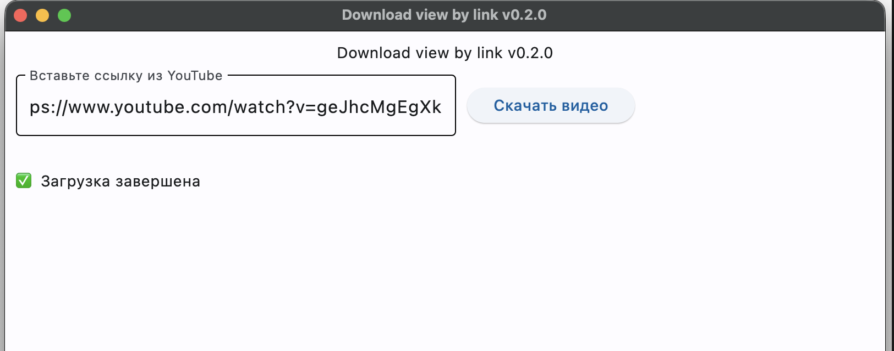

# A download-video-by-link Flet app

An example of a minimal Flet app.

To run the app:

```
python3 -m venv venv
source venv/bin/activate
pip install -r requirements.txt
flet run [app_directory]
```


## Todo
- [ ] Выбрать путь где сохранить файл иначе в home
- [x] Добавить прогресс бар
- [ ] Вывести сообщение после завершения
- [ ] Выбрать качество для скачивания
- [ ] Возможность выберать формат
- [ ] Возможность скачивать несколько сылок одновременно
- [ ] Отделить конфиги
- [ ] Подправить UI